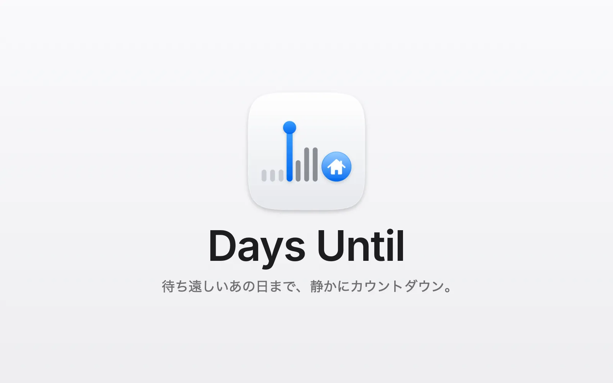
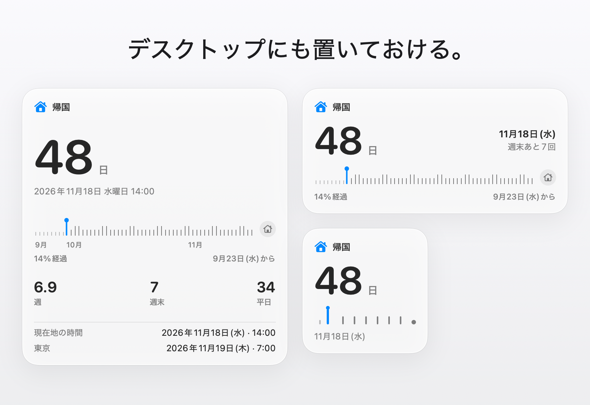

<p align="center">
  <picture>
    <source media="(prefers-color-scheme: dark)" srcset="design/assets/03-stacked/days-until-stacked-dark-512.png">
    
  </picture>
</p>

<p align="center">
  <a href="https://github.com/soondubu137/days-until/releases"></a>
  
  
  <a href="LICENSE"></a>
</p>

<p align="center"><a href="README.md">English</a> · <a href="README.zh-CN.md">简体中文</a> · <a href="README.zh-TW.md">繁體中文</a> · 日本語 · <a href="README.ko.md">한국어</a></p>

<h3 align="center">待ち遠しいあの日まで、静かにカウントダウン。</h3>
<p align="center">その日を待つ気持ちを、いつも目の届くところに。</p>



帰省のフライト、結婚式、卒業式、ずっと楽しみにしていた旅行。来る前から何度も思い浮かべてしまう日があります。Days Until はその日を Mac のメニューバーに置いて、仕事中も、勉強中も、待っているあいだも、ひと目でわかるようにします。

タイマーではありません。開始も一時停止も、ポモドーロもありません。メニューバーで何週間も、何か月も静かに待ち、その日が近づくにつれて表示が細かくなっていきます。

## 主な機能

### デスクトップウィジェット

*バージョン 0.2.0 で追加*



- 小・中・大の3サイズ。同じカウントダウンとタイムラインを表示します（macOS 14以降）
- ウィジェットをクリックするとポップオーバーが開きます

### メニューバー

- 標準は適応型：日数 → 日数と時間 → 最後の24時間は秒単位のライブカウントダウン
- 5種類の表示スタイル。スペースが足りないときはアイコンだけにもできます

### ポップオーバー

- より大きく、より細かいカウントダウン
- 過ぎた日々とこれからの日々を示すタイムライン。残りの週末と平日の数もわかります（祝日は除外しません）
- 2つ目の時間帯を追加して、両方の時刻を並べて表示することもできます

### カウントダウンを設定

- カウントダウンはひとつ：名前、アイコン、日付
- 必要なら時刻と2つ目の時間帯も指定できます
- 夏時間の切り替えや、時間帯をまたぐ移動があっても、カウントダウンはずれません
- 予定が変わったら、カウントダウンを削除できます。思い直したときは取り消しもできます

### 当日

- ポップオーバーを開くと紙吹雪が舞い、待ちに待った日をお祝いします

### 言語

- English、简体中文、繁體中文、日本語、한국어に対応。Mac の言語設定に合わせて表示されます

## インストール

**macOS 13 以降**が必要です。

[GitHub Releases](https://github.com/soondubu137/days-until/releases) からリリースパッケージをダウンロードして展開し、**DaysUntil.app** を「アプリケーション」フォルダにドラッグします。

現在のリリースは ad hoc 署名で、Apple の公証を受けていません。初めて開くときに macOS が開発元を検証できない場合は、ダウンロード元が信頼できることを確認してから、「システム設定」→「プライバシーとセキュリティ」で「このまま開く」をクリックしてください。詳しくは [Apple の説明](https://support.apple.com/ja-jp/102445)をご覧ください。

### ソースからビルド

Xcode 27 をインストールしてから：

```bash
git clone https://github.com/soondubu137/days-until.git
cd days-until
open DaysUntil.xcodeproj
```

**DaysUntil** スキームと **My Mac** を選択し、**⌘R** を押します。プロジェクトは標準で ad hoc 署名を使うので、有料のデベロッパアカウントは必要ありません。

プロジェクトのディレクトリから、コマンドラインでビルドして起動することもできます：

```bash
xcodebuild -project DaysUntil.xcodeproj -scheme DaysUntil \
  -configuration Release -derivedDataPath /tmp/days-until-build \
  CODE_SIGN_IDENTITY=- build
open /tmp/days-until-build/Build/Products/Release/DaysUntil.app
```

## ライセンス

Copyright © 2026 Yinfeng Lu。**GNU GPL バージョン 3 またはそれ以降のバージョン**（GPL-3.0-or-later）でライセンスされています。ライセンス表示は [COPYRIGHT](COPYRIGHT) を、条件の全文は [LICENSE](LICENSE) をご覧ください。これらの条件のもとで、本プロジェクトを使用、改変、配布できます。改変版を配布する場合は GPL のもとで配布する必要があり、アプリを配布する場合は GPL の定めに従って対応するソースコードを提供する必要があります。本ソフトウェアは無保証です。

サードパーティの素材には、それぞれのライセンスが適用されます。[Unicode の絵文字データ](DaysUntil/Resources/Emoji.tsv)には、そのライセンス表示が含まれています。
