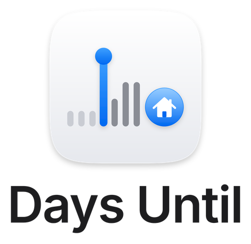
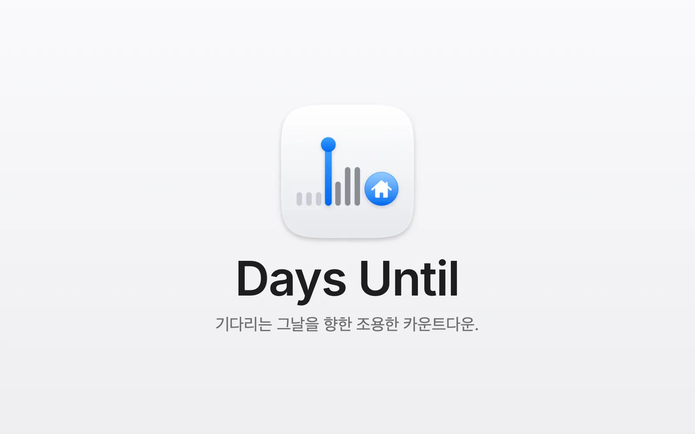
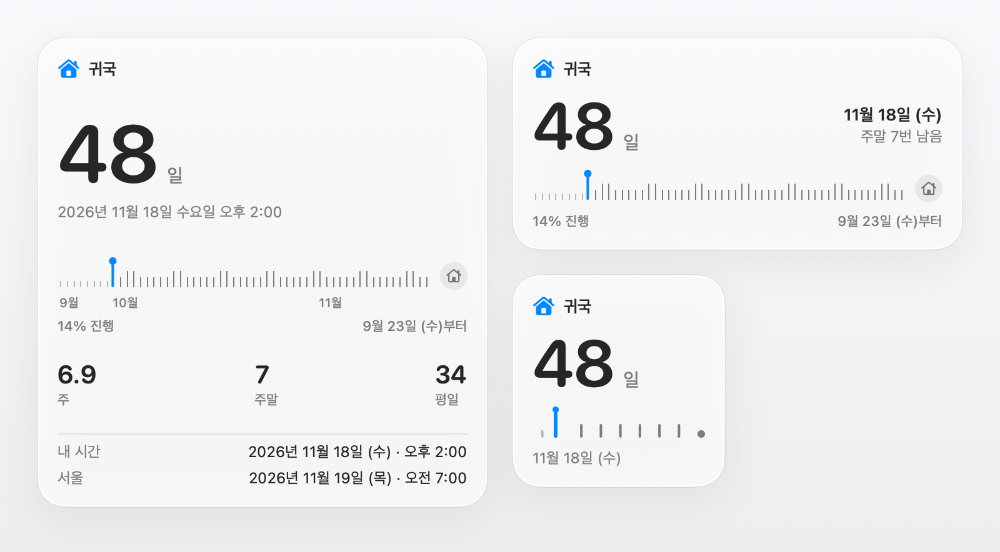

<p align="center">
  <picture>
    <source media="(prefers-color-scheme: dark)" srcset="design/assets/03-stacked/days-until-stacked-dark-512.png">
    
  </picture>
</p>

<p align="center">
  <a href="https://github.com/soondubu137/days-until/releases"></a>
  
  
  <a href="LICENSE"></a>
</p>

<p align="center"><a href="README.md">English</a> · <a href="README.zh-CN.md">简体中文</a> · <a href="README.zh-TW.md">繁體中文</a> · <a href="README.ja.md">日本語</a> · 한국어</p>

<h3 align="center">기다리는 그날을 향한 조용한 카운트다운.</h3>
<p align="center">설렘은 언제나 눈길 닿는 곳에.</p>



집으로 가는 비행기, 결혼식, 졸업식, 오래 기다려 온 여행. 어떤 날은 오기 훨씬 전부터 마음속에 자리 잡습니다. Days Until은 그날을 Mac의 메뉴 막대에 올려 두어, 일할 때도, 공부할 때도, 기다릴 때도 한눈에 볼 수 있게 해 줍니다.

타이머가 아닙니다. 시작이나 일시 정지도, 뽀모도로도 없습니다. 몇 주, 몇 달이고 메뉴 막대에 조용히 머물며, 그날이 가까워질수록 더 정밀한 시간을 보여 줍니다.

## 주요 기능

### 데스크탑 위젯

*버전 0.2.0에서 추가됨*

<picture>
  <source media="(prefers-color-scheme: dark)" srcset="design/days-until-widgets-dark.ko.webp">
  
</picture>

- 소형, 중형, 대형 세 가지 크기로 같은 카운트다운과 타임라인 표시(macOS 14 이상)
- 위젯을 클릭하면 팝오버가 열립니다

### 메뉴 막대

- 기본은 적응형: 일수 → 일수와 시간 → 마지막 24시간에는 초 단위 실시간 카운트다운
- 다섯 가지 표시 스타일. 공간이 부족할 때는 아이콘만 표시할 수도 있습니다

### 팝오버

- 더 크고 정밀한 카운트다운
- 지나온 날과 남은 날을 보여 주는 타임라인, 남은 주말과 평일 수 표시(공휴일은 빼지 않음)
- 두 번째 시간대를 추가해 두 곳의 시간을 함께 확인

### 카운트다운 설정

- 카운트다운 하나: 이름, 아이콘, 날짜
- 필요하면 정확한 시간과 두 번째 시간대도 지정
- 일광 절약 시간 전환이나 시간대를 넘나드는 이동에도 카운트다운이 어긋나지 않음
- 계획이 바뀌었나요? 카운트다운을 삭제할 수 있고, 마음이 바뀌면 실행 취소할 수 있습니다

### 그날

- 팝오버를 열면 색종이가 흩날리며 기다려 온 그날을 축하합니다

### 언어

- English, 简体中文, 繁體中文, 日本語, 한국어 지원. Mac의 언어 설정을 따릅니다

## 설치

**macOS 13 이상**이 필요합니다.

[GitHub Releases](https://github.com/soondubu137/days-until/releases)에서 릴리스 패키지를 다운로드해 압축을 푼 다음, **DaysUntil.app**을 **응용 프로그램** 폴더로 드래그합니다.

릴리스는 Developer ID로 서명되고 Apple의 공증을 받았으므로, 처음 열 때 macOS가 개발자를 확인할 수 있습니다.

### 소스에서 빌드

Xcode 27을 설치한 다음:

```bash
git clone https://github.com/soondubu137/days-until.git
cd days-until
open DaysUntil.xcodeproj
```

**DaysUntil** 스킴과 **My Mac**을 선택하고 **⌘R**을 누릅니다. 프로젝트는 기본적으로 ad hoc 서명을 사용하므로 유료 개발자 계정이 필요하지 않습니다.

프로젝트 디렉터리에서 명령줄로 빌드하고 실행할 수도 있습니다:

```bash
xcodebuild -project DaysUntil.xcodeproj -scheme DaysUntil \
  -configuration Release -derivedDataPath /tmp/days-until-build \
  CODE_SIGN_IDENTITY=- build
open /tmp/days-until-build/Build/Products/Release/DaysUntil.app
```

## 라이선스

Copyright © 2026 Yinfeng Lu. **GNU GPL 버전 3 또는 그 이후 버전**(GPL-3.0-or-later)으로 배포됩니다. 라이선스 고지는 [COPYRIGHT](COPYRIGHT)를, 전체 조건은 [LICENSE](LICENSE)를 참고하십시오. 이 조건에 따라 이 프로젝트를 사용, 수정, 배포할 수 있습니다. 수정본을 배포할 때는 GPL을 유지해야 하며, 앱을 배포할 때는 GPL이 요구하는 대로 해당 소스 코드를 제공해야 합니다. 이 소프트웨어는 어떠한 보증도 없이 제공됩니다.

제3자 자료에는 각자의 라이선스가 적용됩니다. [Unicode 이모지 데이터](DaysUntil/Resources/Emoji.tsv)에는 해당 라이선스 고지가 포함되어 있습니다.
