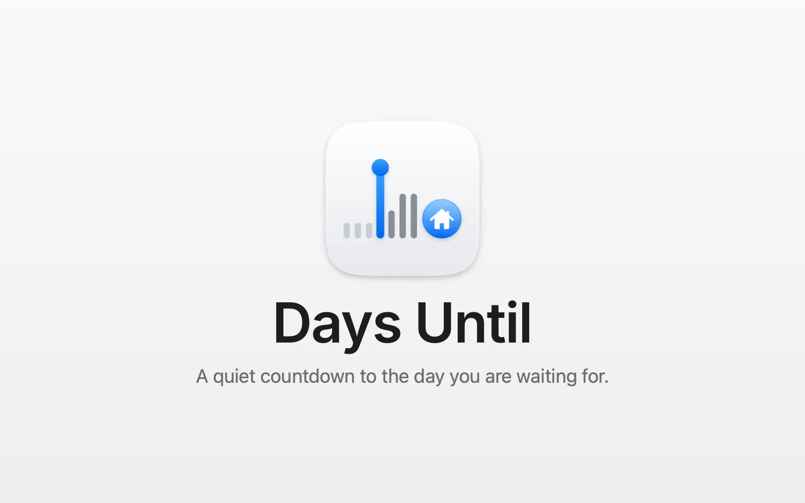
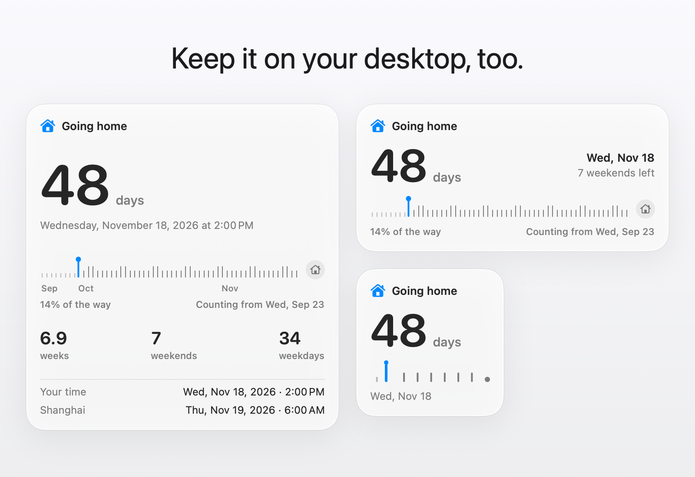

<p align="center">
  <picture>
    <source media="(prefers-color-scheme: dark)" srcset="design/assets/03-stacked/days-until-stacked-dark-512.png">
    
  </picture>
</p>

<p align="center">
  <a href="https://github.com/soondubu137/days-until/releases"></a>
  
  
  <a href="LICENSE"></a>
</p>

<p align="center">English · <a href="README.zh-CN.md">简体中文</a> · <a href="README.zh-TW.md">繁體中文</a> · <a href="README.ja.md">日本語</a> · <a href="README.ko.md">한국어</a></p>

<h3 align="center">A quiet countdown to the day you are waiting for.</h3>
<p align="center">Anticipation, always a glance away.</p>



A flight home, a wedding, graduation, a trip you've been looking forward to. Some days live in your head long before they arrive. Days Until puts that day in your Mac's menu bar, a glance away while you work, study, or wait.

It's not a timer. No start or pause, no Pomodoro sessions. It sits quietly in your menu bar for weeks or months, showing more precise time as the day gets closer.

## Installation

Requires **macOS 13 or later**.

Download the disk image (`.dmg`) from [GitHub Releases](https://github.com/soondubu137/days-until/releases), open it, and drag **Days Until** onto the **Applications** folder beside it.

## Features

### Desktop widget

*Added in version 0.2.0*

<picture>
  <source media="(prefers-color-scheme: dark)" srcset="design/days-until-widgets-dark.webp">
  
</picture>

- Small, Medium and Large widgets with the same countdown and progress timeline, on macOS 14 or later
- Click the widget to open the popover

### Your countdown, start to finish

- Give it a name, an icon and a date, plus an exact time and a second time zone if you need them
- The menu bar adapts as the day gets closer: days → days and hours → a live countdown to the second in the final 24 hours, in five display styles including icon-only
- The popover shows a larger, more precise countdown, a progress timeline with the weekends and weekdays left (public holidays aren't excluded), and both local times side by side
- It stays on track through daylight saving changes and travel across time zones
- Plans changed? Delete it, with Undo if you change your mind
- When the day arrives, open the popover for a little confetti

### Milestone notifications

*Added in version 0.4.0*

- A notification at 100 days, 30 days and a week to go, the day before, and on the day. Turn it on with Notify Me in the ••• menu

### Automatic updates

*Added in version 0.3.0*

- Keeps itself up to date: new versions download in the background and install while your display sleeps
- Rather decide yourself? Choose Ask Before Installing or Don't Check in the ••• menu

### Languages

- English, 简体中文, 繁體中文, 日本語 and 한국어, following your Mac's language

## Build from source

Install Xcode 27, then:

```bash
git clone https://github.com/soondubu137/days-until.git
cd days-until
open DaysUntil.xcodeproj
```

Select the **DaysUntil** scheme and **My Mac**, then press **⌘R**. The project uses ad hoc signing by default, so you don't need a paid developer account.

You can also build and launch from the project directory:

```bash
xcodebuild -project DaysUntil.xcodeproj -scheme DaysUntil \
  -configuration Release -derivedDataPath /tmp/days-until-build \
  CODE_SIGN_IDENTITY=- build
open "/tmp/days-until-build/Build/Products/Release/Days Until.app"
```

## License

Copyright © 2026 Yinfeng Lu. Licensed under **GNU GPL version 3 or any later version (GPL-3.0-or-later)**. See [COPYRIGHT](COPYRIGHT) for the licensing notice and [LICENSE](LICENSE) for the full terms. You may use, modify, and distribute this project under those terms. Distributed modifications must remain under the GPL, and app distributions must provide corresponding source as required by the GPL. This software comes without warranty.

Third-party materials retain their own licenses. The [Unicode emoji data](DaysUntil/Resources/Emoji.tsv) includes its license notice.
