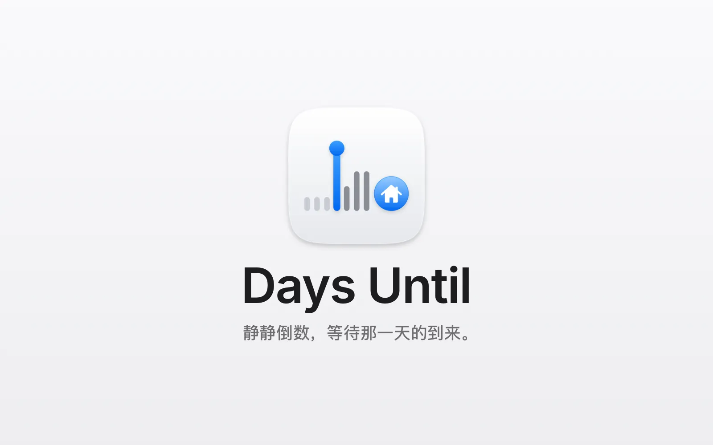
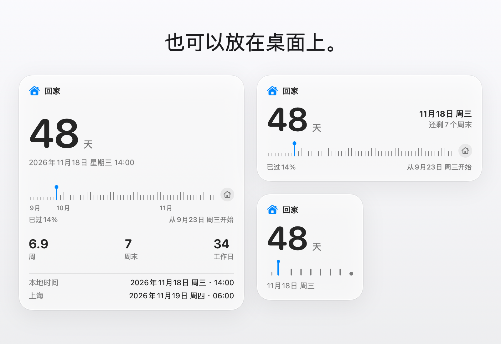

<p align="center">
  <picture>
    <source media="(prefers-color-scheme: dark)" srcset="design/assets/03-stacked/days-until-stacked-dark-512.png">
    
  </picture>
</p>

<p align="center">
  <a href="https://github.com/soondubu137/days-until/releases"></a>
  
  
  <a href="LICENSE"></a>
</p>

<p align="center"><a href="README.md">English</a> · 简体中文 · <a href="README.zh-TW.md">繁體中文</a> · <a href="README.ja.md">日本語</a> · <a href="README.ko.md">한국어</a></p>

<h3 align="center">静静倒数，等待那一天的到来。</h3>
<p align="center">期待，就在每一次抬眼之间。</p>



回家的航班、婚礼、毕业典礼、盼了很久的旅行。有些日子，还没到就已经想过很多遍。Days Until 把那个日子放进 Mac 的菜单栏，让你在工作时，学习时，等待时，一眼就能看到。

它不是计时器，没有开始/暂停，没有番茄钟。它在菜单栏安静地待上几周甚至几个月，时间显示会自动随着日子的临近而变得越来越精确。

## 安装

需要 **macOS 13 或更新版本**。

从 [GitHub Releases](https://github.com/soondubu137/days-until/releases) 下载磁盘映像（`.dmg`），打开后将 **Days Until** 拖到旁边的「应用程序」文件夹。

## 主要功能

### 桌面小组件

*0.2.0 版本新增*

<picture>
  <source media="(prefers-color-scheme: dark)" srcset="design/days-until-widgets-dark.zh-CN.webp">
  
</picture>

- 小、中、大三种尺寸，显示同样的倒数和进度条（需要 macOS 14 或更高版本）
- 点按小组件即可打开弹窗

### 从设置倒数到那一天

- 设置名字，图标，日期，需要的话再加上精确时间和第二个时区
- 菜单栏默认自适应精度：天数 → 天数+小时 → 最后 24 小时变成实时秒表；共5种显示样式，空间不够时可以只保留图标
- 点开弹窗：精度更高的大字读数，显示剩余周末和工作日的进度条（不区分法定节假日），还有两地时刻对照
- 夏令时切换，跨时区移动，倒数都不会乱
- 计划有变？可以删除倒数，删错了也能撤销
- 当天打开弹窗，有五彩纸屑，庆祝你等了很久的这天终于到来了

### 里程碑通知

*0.4.0 版本新增*

- 还剩 100 天、30 天和一周时，前一天和当天，各发一条通知。在 ••• 菜单里打开“通知我”

### 自动更新

*0.3.0 版本新增*

- 自动保持最新：新版本在后台下载，在显示器休眠时安装
- 想自己决定？在 ••• 菜单里选择“安装前询问”或“不检查”

### 语言

- 支持 English，简体中文，繁體中文，日本語和한국어，自动跟随 Mac 的系统语言

## 从源码运行

安装 Xcode 27，然后：

```bash
git clone https://github.com/soondubu137/days-until.git
cd days-until
open DaysUntil.xcodeproj
```

选择 **DaysUntil** scheme 和 **My Mac**，按 **⌘R**。项目默认使用 ad hoc 签名，无需付费开发者账号。

也可以在项目目录通过命令行构建并打开：

```bash
xcodebuild -project DaysUntil.xcodeproj -scheme DaysUntil \
  -configuration Release -derivedDataPath /tmp/days-until-build \
  CODE_SIGN_IDENTITY=- build
open "/tmp/days-until-build/Build/Products/Release/Days Until.app"
```

## 许可证

Copyright © 2026 Yinfeng Lu。项目采用 **GNU GPL 第 3 版或任何后续版本（GPL-3.0-or-later）**，授权声明见 [COPYRIGHT](COPYRIGHT)，完整条款见 [LICENSE](LICENSE)。你可以按该许可证使用、修改和分发；分发修改版时须保留 GPL 许可，分发应用时须按 GPL 提供对应源码。软件不提供任何担保。

第三方材料保留各自许可，其中 [Unicode 表情数据](DaysUntil/Resources/Emoji.tsv) 的许可随文件附带。
