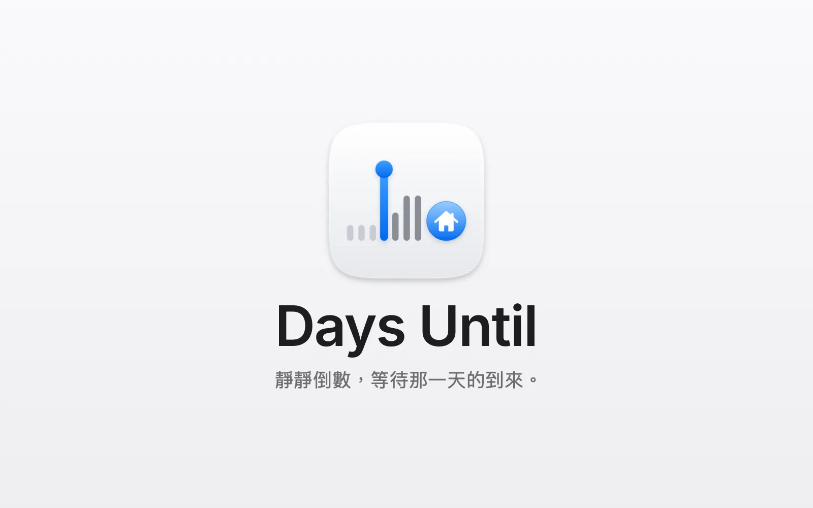
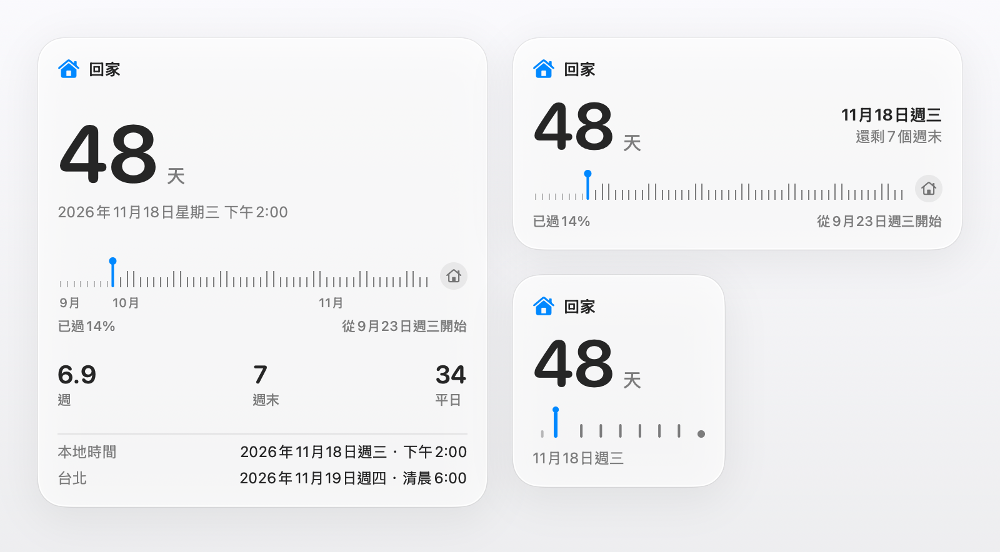

<p align="center">
  <picture>
    <source media="(prefers-color-scheme: dark)" srcset="design/assets/03-stacked/days-until-stacked-dark-512.png">
    
  </picture>
</p>

<p align="center">
  <a href="https://github.com/soondubu137/days-until/releases"></a>
  
  
  <a href="LICENSE"></a>
</p>

<p align="center"><a href="README.md">English</a> · <a href="README.zh-CN.md">简体中文</a> · 繁體中文 · <a href="README.ja.md">日本語</a> · <a href="README.ko.md">한국어</a></p>

<h3 align="center">靜靜倒數，等待那一天的到來。</h3>
<p align="center">期待，就在每一次抬眼之間。</p>



回家的班機、婚禮、畢業典禮、盼了很久的旅行。有些日子，還沒到就已經想過很多遍。Days Until 把那一天放進 Mac 的選單列，讓你在工作時、讀書時、等待時，一眼就能看到。

它不是計時器，沒有開始／暫停，也沒有番茄鐘。它在選單列安靜地待上幾週甚至幾個月，時間顯示會隨著日子接近，自動變得越來越精確。

## 主要功能

### 桌面小工具

*0.2.0 版新增*

<picture>
  <source media="(prefers-color-scheme: dark)" srcset="design/days-until-widgets-dark.zh-TW.webp">
  
</picture>

- 小、中、大三種尺寸，顯示同樣的倒數和進度條（需要 macOS 14 或以上版本）
- 按一下小工具就能打開彈出視窗

### 選單列

- 預設自動調整精確度：天數 → 天數＋小時 → 最後 24 小時變成即時倒數到秒
- 5 種顯示樣式，選單列空間不夠時可以只顯示圖像

### 點開彈出視窗

- 精確度更高的大字讀數
- 進度條：清楚呈現已經度過的日子、還剩幾天，其中有多少週末、多少平日（不扣除國定假日）
- 可選的第二時區：兩地時間對照

### 設定倒數

- 一個倒數：名稱、圖像、日期
- 可以設定精確的倒數時間，再加上第二時區
- 日光節約時間切換、跨時區移動，倒數都不會亂
- 計畫有變？可以刪除倒數，刪錯了也能還原

### 當天

- 打開彈出視窗，會有彩色紙花，慶祝你等了很久的這天終於到來

### 語言

- 支援 English、简体中文、繁體中文、日本語和한국어，自動跟隨 Mac 的系統語言

## 安裝

需要 **macOS 13 或以上版本**。

從 [GitHub Releases](https://github.com/soondubu137/days-until/releases) 下載發行套件，解壓縮後將 **DaysUntil.app** 拖到「應用程式」。

發行版本使用 Developer ID 簽署並經過 Apple 公證，首次打開時 macOS 能夠驗證開發者。

### 從原始碼執行

安裝 Xcode 27，然後：

```bash
git clone https://github.com/soondubu137/days-until.git
cd days-until
open DaysUntil.xcodeproj
```

選擇 **DaysUntil** scheme 和 **My Mac**，按下 **⌘R**。專案預設使用 ad hoc 簽署，不需要付費開發者帳號。

也可以在專案目錄用命令列建置並打開：

```bash
xcodebuild -project DaysUntil.xcodeproj -scheme DaysUntil \
  -configuration Release -derivedDataPath /tmp/days-until-build \
  CODE_SIGN_IDENTITY=- build
open /tmp/days-until-build/Build/Products/Release/DaysUntil.app
```

## 授權條款

Copyright © 2026 Yinfeng Lu。本專案採用 **GNU GPL 第 3 版或任何更新版本（GPL-3.0-or-later）** 授權，授權聲明見 [COPYRIGHT](COPYRIGHT)，完整條款見 [LICENSE](LICENSE)。你可以依照該授權使用、修改和散布；散布修改版時須保留 GPL 授權，散布應用程式時須依 GPL 提供對應的原始碼。本軟體不提供任何擔保。

第三方素材保留各自的授權，其中 [Unicode 表情符號資料](DaysUntil/Resources/Emoji.tsv) 的授權聲明隨檔案附帶。
